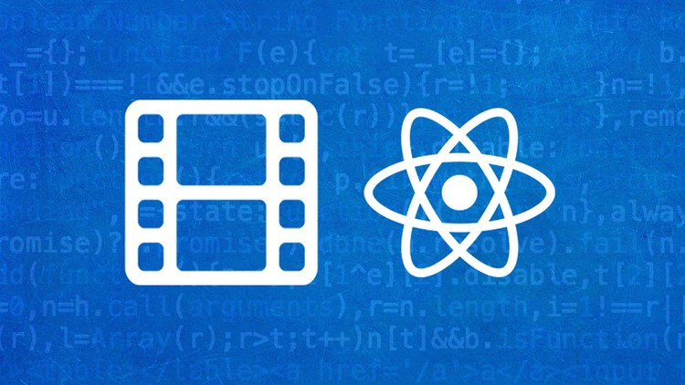

<link rel="stylesheet" href="./style.css"/>

## \<SIDE PROJECT>

# React movie app

<table>
    <tr>
        <td align="center">
            
        </td>
    </tr>
</table>

# **Objectives**

- CRA(create-react-app)를 사용하지 않고, 직접 초기 프로젝트 셋팅을 함으로써 webpack의 필요성을 이해하고, 직접 webpack을 customizing해서 사용 할 수 있도록 한다.
- 테스트 주도 개발(TDD) 방식으로 개발을 진행합니다.
- React를 사용해서 구현한 어플리케이션의 성능을 최적화한다.
- 기존에 작성한 JavaScript어플리케이션을 TypeScript를 적용한다.
- HTML을 웹 표준과 접근성을 고려해서 마크업한다.

# **Used Tech Stacks**

- ## Front-End
  HTML, CSS, JavaScript, TypeScript, React(hook)
- ## Test
  Jest, RTL(React Testing Library)
- ## Branch management
  Git flow model로 branch 관리
- ## Back-End
  None
- ## Database
  None

# **Project Status**

# **Project Screen Shots**

# **Installation and Setup Instruction**

# **Project Reflection**

Q1.&nbsp;<b>이 프로젝트를 하게 된 배경은 무엇인가?</b>  
→

Q2.&nbsp;<b>무엇을 만들기 위한 목적으로 개발되었나요?</b>  
→

Q3.&nbsp;<b>이 프로젝트를 통해서 얻고자 하는 것과 개발경험에 있어, 어떤 부분이 도움이 되었는가?</b>  
→

Q4.&nbsp;<b>프로젝트 진행중에 예상치 못했던 어려움이 있었나?</b>  
→

Q5.&nbsp;<b>이 프로젝트를 구현함에 있어 사용했던 도구/라이브러리는 무엇입니까?</b>  
→
