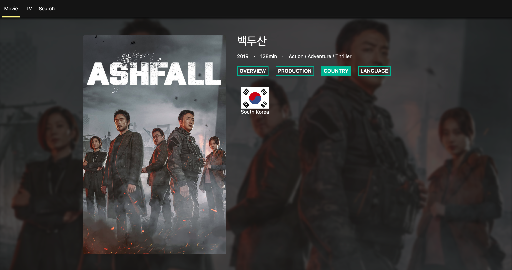

<link rel="stylesheet" href="./style.css"/>

## \<SIDE PROJECT>

# React movie app

  

# **Objectives**

- CRA(create-react-app)를 사용하지 않고, 직접 초기 프로젝트 셋팅을 함으로써 webpack의 필요성을 이해하고, 직접 webpack을 customizing해서 사용 할 수 있도록 한다.
- 테스트 주도 개발(TDD) 방식으로 개발을 진행합니다.
- React를 사용해서 구현한 어플리케이션의 성능을 최적화한다.
- 기존에 작성한 JavaScript어플리케이션을 TypeScript를 적용한다.
- HTML을 웹 표준과 접근성을 고려해서 마크업한다.

# **Used Tech Stacks**

- ## Front-End
  HTML, CSS, JavaScript, React(hook)
- ## Test
  Jest, RTL(React Testing Library)
- ## Branch management
  Git flow model로 branch 관리

# **Project Reflection**

<b>Q1.&nbsp;이 프로젝트를 하게 된 배경은 무엇인가?</b>  

→ 우선 TDD 방식으로 **테스트 코드 작성 - 테스트 코드를 통과하기 위한 코드 작성 - 코드 리팩토링 사이클**로 프로젝트를 진행해보기 위해서 본 프로젝트를 시작하게 되었습니다.
기본적인 TDD에 대한 개념공부과 개별 저장소를 만들어서 테스트 코드 작성연습을 해보았는데, 실제로 작은 프로젝트를 만들어보면, 예상치 못한 상황을 겪으면서 또 다른 부분을 배울 수 있다고 생각했습니다.

<b>Q2.&nbsp;무엇을 만들기 위한 목적으로 개발되었나요?</b>  

→ 단순히 무엇을 보여주기 위한 목적으로 진행한 프로젝트가 아닙니다. 기존에 제가 공부해왔던 내용을 적용시켜보고 시행착오를 통해 더욱 더 자기개발을 하며 배워나가기 위해서 프로젝트를 진행했습니다. 작은 프로젝트이지만 오히려 TDD 방식을 적용해보는데 좋았다고 생각합니다. 중간 중간에 발생하는 에러를 통해 기존에 알고 있던 내용들 이외의 것들을 배우게 되었고, 틈틈이 배운 내용에 대해서 블로그에 포스팅을 했습니다.

<b>Q3.&nbsp;이 프로젝트를 통해서 얻고자 하는 것과 개발경험에 있어, 어떤 부분이 도움이 되었는가?</b>  

→ 우선 본 프로젝트를 통해 얻고자 했던 것은 개발자로서 좋은 습관을 개인 프로젝트를 통해 더욱 더 습관화시켜나가는 것이었습니다. 실제 업무를 할 때 다른 개발자 분들과 함께 협업을 하기 때문에 Issue 및 Pull Request 작성, branch 관리, 작업한 내용에 대한 꼼꼼한 commit message 작성 등을 스스로 신경을 써서 프로젝트를 진행했습니다.
물론 이전에 다른 프로젝트들을 통해서 연습을 해왔기 때문에 지금은 작업 이전에 Issue 작성 및 branch 관리 등 협업시에 필요한 작업들을 하는 것에 대해서 익숙해졌습니다.

<b>Q4.&nbsp;프로젝트 진행중에 예상치 못했던 어려움이 있었나?</b>  

→ 물론 있었습니다. 테스트 코드 작성에 있어서 이론적으로나 간단한 코드 작성으로만 공부했던 부분에 있어서, 직접 사이드 프로젝트에 적용을 시켜보니 기존에 학습했던 부분에 대해서 더욱 더 확실하게 이해를 할 수 있었고, 부족한 부분들에 대해서는 스스로 학습을 통해 보충할 수 있는 좋은 기회가 되었습니다.
특히 RTL을 이용해서 mock 테스트를 하는데 좋은 연습이 되었다고 생각하고, 그 외에 다양한 query의 작성과 각 각의 query들의 차이점에 대해서도 추가적으로 공부할 수 있었습니다.

# **Project Status**

🗓️ 2021.05.01(Sat)

**(1) Issue1) Initial setup for project**

→ [https://github.com/LeeHyungi0622/react-movie-app/issues/1](https://github.com/LeeHyungi0622/react-movie-app/issues/1)

**(2) Issue3) header 컴포넌트 만들기**

→ [https://github.com/LeeHyungi0622/react-movie-app/issues/3](https://github.com/LeeHyungi0622/react-movie-app/issues/3)

🗓️ 2021.05.02(Sun)

**(3) Issue5) Loading 컴포넌트 만들기**

→ [https://github.com/LeeHyungi0622/react-movie-app/issues/5](https://github.com/LeeHyungi0622/react-movie-app/issues/5)

**(4) Issue6) header 컴포넌트의 메뉴 클릭 이벤트와 관련된 테스트 코드작성**

→ [https://github.com/LeeHyungi0622/react-movie-app/issues/6](https://github.com/LeeHyungi0622/react-movie-app/issues/6)

**(5) Issue8) README 파일에 Project status 업데이트**

→ [https://github.com/LeeHyungi0622/react-movie-app/issues/8](https://github.com/LeeHyungi0622/react-movie-app/issues/8)

🗓️ 2021.05.04(Tue)

**(6) Issue10) Movie Poster 컴포넌트 만들기**

→ [https://github.com/LeeHyungi0622/react-movie-app/issues/10](https://github.com/LeeHyungi0622/react-movie-app/issues/10)

**(7) Issue11) Section 컴포넌트 만들기**

→ [https://github.com/LeeHyungi0622/react-movie-app/issues/11](https://github.com/LeeHyungi0622/react-movie-app/issues/11)

🗓️ 2021.05.05(Wed)

**(8) Issue14) 컨텐츠를 가져오기 위한 API 작성하기**

→ [https://github.com/LeeHyungi0622/react-movie-app/issues/14](https://github.com/LeeHyungi0622/react-movie-app/issues/14)

**(9) Issue17) API 테스트 코드 수정**

→ [https://github.com/LeeHyungi0622/react-movie-app/issues/17](https://github.com/LeeHyungi0622/react-movie-app/issues/17)

🗓️ 2021.05.06(Thu)

**(10) Issue21) 개봉예정/현재 흥행중인 영화 컨텐츠 정보 메인화면에 표시하기**

→ [https://github.com/LeeHyungi0622/react-movie-app/issues/21](https://github.com/LeeHyungi0622/react-movie-app/issues/21)

**(11) Issue24) Slider 컴포넌트 만들기**

→ [https://github.com/LeeHyungi0622/react-movie-app/issues/24](https://github.com/LeeHyungi0622/react-movie-app/issues/24)

🗓️ 2021.05.07(Fri)

**(12) Issue26) TV 페이지 완성하기**

→ [https://github.com/LeeHyungi0622/react-movie-app/issues/26](https://github.com/LeeHyungi0622/react-movie-app/issues/26)

🗓️ 2021.05.09(Mon)

**(12) Issue29) 컨텐츠 상세보기 페이지 만들기**

→ [https://github.com/LeeHyungi0622/react-movie-app/issues/29](https://github.com/LeeHyungi0622/react-movie-app/issues/29)

🗓️ 2021.05.12(Wed)

**(13) Issue32) Detail 페이지의 Country, Trailers, Language 탭 페이지 완성**

→ [https://github.com/LeeHyungi0622/react-movie-app/issues/32](https://github.com/LeeHyungi0622/react-movie-app/issues/32)

**(14) Issue35) 컨텐츠 검색 결과 페이지 만들기**

→ [https://github.com/LeeHyungi0622/react-movie-app/issues/35](https://github.com/LeeHyungi0622/react-movie-app/issues/35)

# **Project Screen Shots**

**영화 컨텐츠 페이지**

  

**TV 컨텐츠 페이지**

  

**상세보기 페이지**

  

# **Installation and Setup Instruction**
